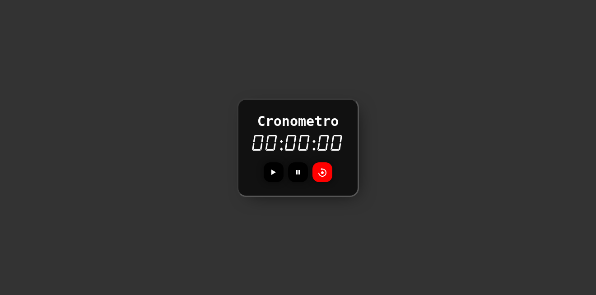

# Cronometro Simple

Este es una web simple de un cronometro usando: HTML, CSS y Vanilla JS. tambien use la libreria de iconos [***Boxicons***](boxicons.com/) para los iconos y la fuente [***Alarm Clock***](https://www.dafont.com/alarm-clock.font)